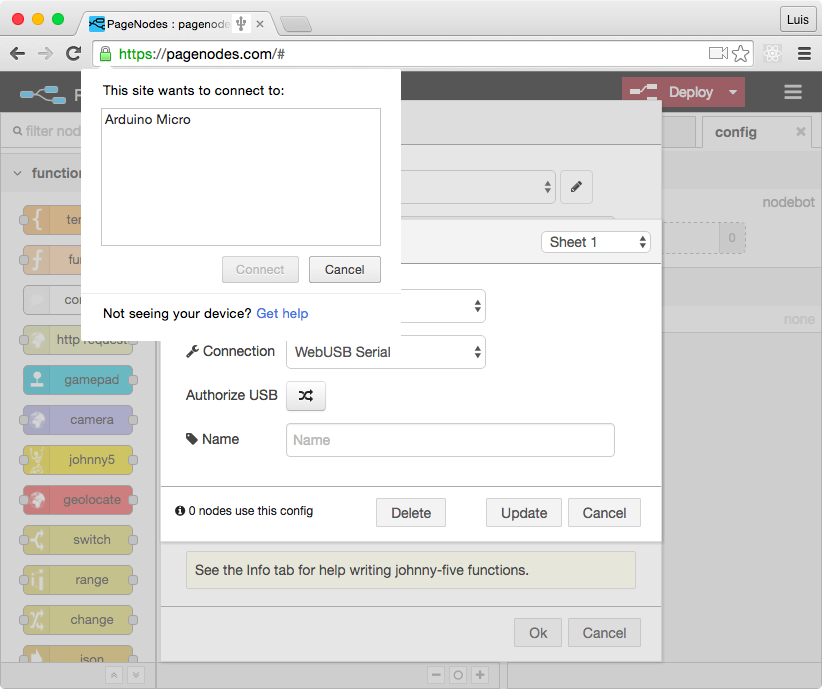

webusb-serial example
=====================

web app connected to an arduino Leonardo or Micro.

## Getting started

First setup the [WebUSB arduino library](https://github.com/webusb/arduino) according to the instructions in the readme, including setting the flag in chrome to enable WebUSB.

Instead of using their rgb example sketch use [sketch/StandardFirmataWebUSB.ino](./sketch/StandardFirmataWebUSB.ino) from this repository.

Next, you can either run pagenodes locally from the instructions in the [pagenodes repository](https://github.com/monteslu/pagenodes) or simply go to [https://PageNodes.com](https://pagenodes.com).

From there you'll need to create a johnny-five node and create a new nodebot of type `firmata` and tranasport of `webusb`.  You'll also need to authorize the Arduino by clicking the `Authorize USB` button.



Inside your nodebot function you have full access to the [johnny-five](http://johnny-five.org/api/) API!

The code in your johnny-five node is what executes when the board is ready.  You can try something as simple as:

```javascript
var led = new five.Led(9);

led.blink(500);
```

## Gotchas

You might have to restart your arduino in order for your pagenodes to reconnect to the device.
Click the reset button on the device, and reload pagenodes when you deploy changes.  Hopefully I'll have that sorted soon.


